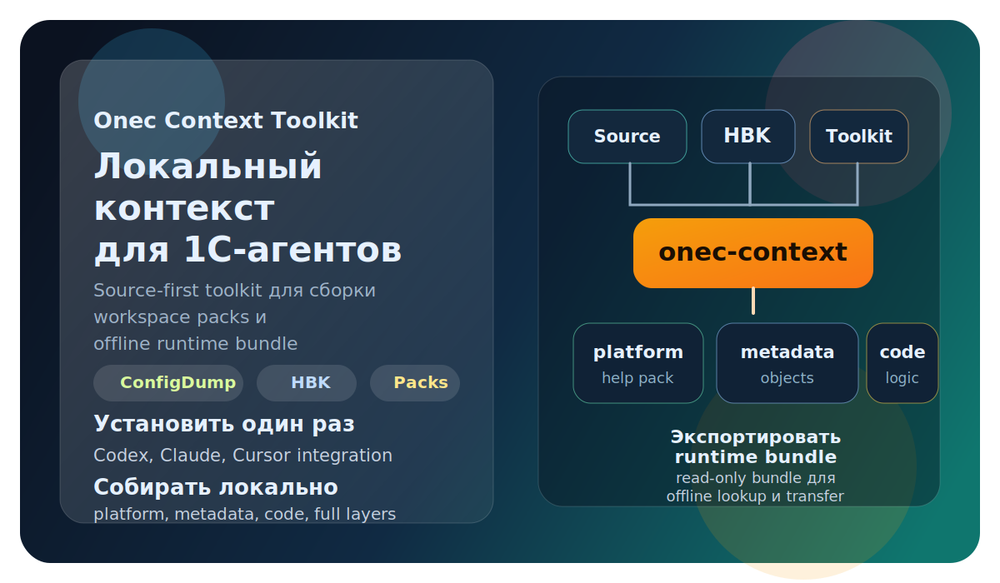
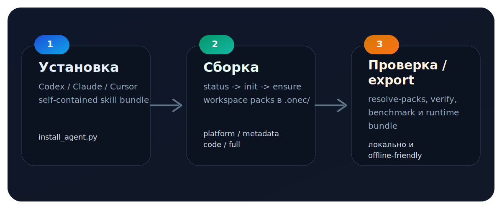

# Onec Context Toolkit



`onec-context-toolkit` превращает 1С-репозиторий в локальный source-first context для агентов. Он ставит self-contained integration в `Codex`, `Claude`, `Cursor`, собирает workspace packs в `.onec/` из `ConfigDump` и `HBK`, а затем умеет экспортировать read-only runtime bundle для offline lookup.



## Что это даёт

| Задача | Что делает toolkit |
| --- | --- |
| Установка в агента | Копирует self-contained skill bundle и supplemental guidance layers |
| Локальный context | Строит `platform`, `metadata`, `code`, `full` packs только когда они реально нужны |
| Контроль drift | Проверяет stale state по platform version, config version и source snapshot |
| Runtime bundle | Экспортирует готовый read-only bundle без rebuild logic |

Если нужен operational workflow и архитектурная модель, они вынесены в [AGENTS.md](AGENTS.md). Отдельный supplemental слой по platform CLI и headless/server операциям лежит в [docs/1c-platform-cli.md](docs/1c-platform-cli.md).

## Быстрый старт за 3 шага

### 1. Поставить integration

Для `Codex`:

```bash
python scripts/install_agent.py --agent codex
```

Для `Claude`:

```bash
python scripts/install_agent.py --agent claude
```

Для `Cursor`:

```bash
python scripts/install_agent.py --agent cursor --workspace /path/to/workspace
```

### 2. Проверить prerequisites

```bash
python scripts/doctor.py --workspace-init --hbk-base /opt/1cv8
```

`HBK` path может указывать на:

- корень платформы
- каталог конкретной версии
- `bin/` внутри каталога версии

На Windows это особенно полезно: можно передавать не только корневой каталог платформы, но и version-specific `bin/`, где реально лежат `.hbk`.

### 3. Собрать базовый workspace

```bash
python scripts/onec_context.py init \
  --workspace-root /path/to/workspace \
  --source-path /path/to/source \
  --profile base \
  --hbk-base /opt/1cv8 \
  --platform 8.2.19.130
```

После этого у workspace уже есть `help` layer. Остальные слои достраиваются по запросу:

```bash
python scripts/onec_context.py ensure --workspace-root /path/to/workspace --need metadata
python scripts/onec_context.py ensure --workspace-root /path/to/workspace --need code
python scripts/onec_context.py ensure --workspace-root /path/to/workspace --need full
```

## Что нужно заранее

- Python `3.11+`
- `zstandard` через локальное Python-окружение toolkit или `zstd` CLI как fallback
- `ConfigDump` или другая поддерживаемая source tree
- доступ к `HBK` для стандартных профилей `base`, `metadata`, `dev`, `full`
- `7z` или `unzip`, если они нужны для распаковки `.hbk`

`HBK` не нужен только в явном нестандартном сценарии с `--without-help`.

## Модель слоёв

| Профиль / need | Что строится | Когда нужен |
| --- | --- | --- |
| `base` | `platform` help pack | platform API, language facts, syntax |
| `metadata` | `platform` + `metadata` | объекты, реквизиты, табличные части, формы |
| `dev` / `code` | `platform` + `metadata` + `code` | обработчики, callers/callees, влияние логики |
| `full` | всё выше + lossless `ConfigDump` pack | raw XML, точные file-level reads, final confirmation |

Ключевой принцип: не строить дорогой слой заранее, если вопрос можно закрыть более дешёвым route.

## Как выглядит рабочий цикл

```text
status -> init/ensure -> resolve-packs -> query/verify/export
```

Практические команды:

```bash
python scripts/onec_context.py status --workspace-root /path/to/workspace --strict
python scripts/onec_context.py resolve-packs --workspace-root /path/to/workspace
python scripts/onec_context.py verify --workspace-root /path/to/workspace
python scripts/onec_context.py benchmark --workspace-root /path/to/workspace --loops 3
python scripts/onec_context.py export --workspace-root /path/to/workspace --archive
```

Если `--source-path` указывает на папку с несколькими `Configuration.xml`, toolkit собирает несколько target packs и записывает их в `.onec/workspace.manifest.json -> targets`. В этом режиме нельзя хардкодить первый попавшийся pack path: сначала нужно выбрать target по имени и версии.

## Режимы использования

### Source repo mode

Работа идёт прямо из checkout этого репозитория. Локальное окружение живёт в `.venv/` в корне repo.

```bash
python scripts/bootstrap.py --deps-only
```

### Installed skill mode

Toolkit копируется прямо в skill directory агента и живёт как self-contained bundle. Локальное окружение создаётся уже внутри установленного skill directory.

При установке integration toolkit ставит:

- основной skill `onec-context`
- supplemental skill `onec-platform-cli`
- supplemental skill `onec-query-strategy`
- supplemental skill `onec-explain-object`
- supplemental skill `onec-platform-fact-check`

## Prompt для агента

<details>
<summary>Показать стартовый prompt</summary>

```text
Работай с этой 1С-задачей через локальный onec-context toolkit.
Сначала проверь workspace и при необходимости инициализируй его.
Перед `init --profile base` найди `HBK` root: сначала в manifest workspace, но только если путь из него ещё существует, потом в `ONEC_HBK_BASE`, потом в `/opt/1cv8`; если его нет, один раз уточни путь у меня.
В качестве `HBK` path допустимы корень платформы, каталог конкретной версии или его `bin/`.
Используй onec-query-strategy, чтобы идти по cheapest-first route: сначала platform или metadata, потом code только если без него нельзя ответить, и full только для raw source/XML.
Если вопрос про объект, реквизит, форму, кнопку, флаг или влияние на поведение, используй onec-explain-object.
Если утверждаешь что-то про платформенный API, синтаксис языка, виды модулей или стандартные методы, сначала проверь это через onec-platform-fact-check.
Если target'ов несколько, выбери нужную конфигурацию по имени и версии или один раз уточни у меня.
Если знаешь версию платформы, используй её при build help pack, чтобы platform lookup был version-exact.
В ответе разделяй подтверждённые факты, выводы по коду и непроверенные предположения.
```

</details>

Если известны входные параметры, полезно дописать сразу:

- путь к workspace
- путь к source tree
- версия платформы
- нужно ли заранее строить `metadata` или `code`

## Инициализация и дополнительные сценарии

### Базовый `help` слой

```bash
python scripts/onec_context.py init \
  --workspace-root /path/to/workspace \
  --source-path /path/to/source \
  --profile base \
  --hbk-base /opt/1cv8 \
  --platform 8.2.19.130
```

### Расширение с несколькими base configs

```bash
python scripts/onec_context.py init \
  --workspace-root /path/to/extension \
  --source-path /path/to/extension \
  --source-kind extension \
  --profile base \
  --hbk-base /opt/1cv8 \
  --base-config "БухгалтерияПредприятия@3.0.184.16" \
  --base-config "УправлениеНашейФирмой@3.0.13.260"
```

### Metadata fallback через `metadata XML export`

```bash
python scripts/onec_context.py init \
  --workspace-root /path/to/workspace \
  --source-path /path/to/workspace \
  --profile metadata \
  --hbk-base /opt/1cv8 \
  --metadata-source /path/to/metadata_export
```

## Что лежит в `.onec/`

Toolkit собирает:

- `.onec/workspace.manifest.json`
- `.onec/packs/platform.<versions>.kb.db.zst`
- `.onec/packs/<source-identity>.metadata.kb.db.zst`
- `.onec/packs/<source-identity>.code.pack.db.zst`
- `.onec/packs/<source-identity>.config.dump.db.zst`
- `.onec/manifests/*.manifest.json`
- `.onec/cache/*.db`

## Что хранить в git

Стоит хранить:

- source code
- templates
- install scripts
- docs

Не стоит хранить:

- `.onec/`
- `build/`
- `dist/`
- большие `artifacts/*.zst`

Рекомендуемая модель распространения:

1. source repo как основной канал
2. optional exported bundle как transfer artifact
3. packs строятся локально в workspace или публикуются как release assets

## Полезные ссылки

- [AGENTS.md](AGENTS.md) — operational workflow для агентов и разработчиков
- [docs/1c-platform-cli.md](docs/1c-platform-cli.md) — platform CLI и headless/server reference
- `python scripts/onec_context.py --help` — карта CLI и quick start прямо в help
